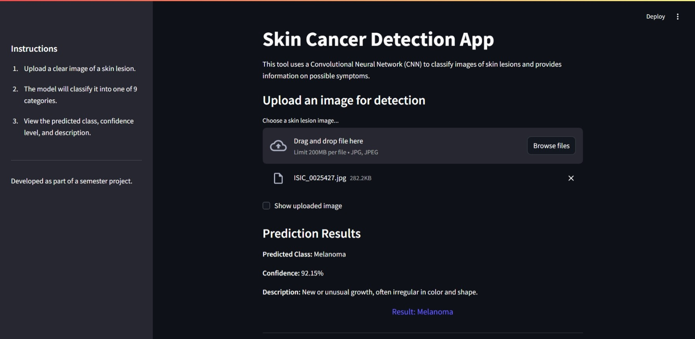

# Skin Cancer Detection using Deep Learning

Skin cancer diagnosis often requires expertise and is time-consuming, leaving room for human error. Automated detection systems can mitigate these issues and provide scalable diagnostic support. This project addresses the challenge of building a CNN-based classification model to distinguish between skin cancer types from dermoscopic images.

Basically, an AI-powered system for detecting different types of skin cancer using a Convolutional Neural Network.

The model classifies dermoscopic skin images into multiple diagnostic categories and provides a possible description of the condition.

This project demonstrates the application of deep learning in medical image classification.

## Features

- CNN-based skin lesion classification
- Streamlit web interface
- Image upload for predictions
- Explanation of possible symptoms

## Classes Detected

* Actinic Keratosis  
* Basal Cell Carcinoma  
* Dermatofibroma  
* Melanoma  
* Nevus  
* Pigmented Benign Keratosis  
* Seborrheic Keratosis  
* Squamous Cell Carcinoma  
* Vascular Lesion

## Setup

Clone the repository

git clone https://github.com/Tulsiishere/SkinCancer_Detection_Using_CNN

Change the directory to

cd SkinCancer_Detection_Using_CNN

Install dependencies

pip install -r requirements.txt

Run the application

streamlit run app/streamlit_app.py

## Model

Download the model from the Releases section
and place it inside the /model folder before running the app.

Users can download and run the model locally for experimentation.

## Disclaimer

This project is for educational and research purposes only and should not be used for medical diagnosis.

## Demo

